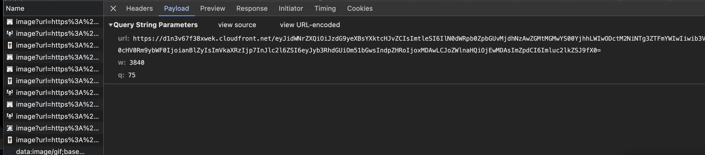
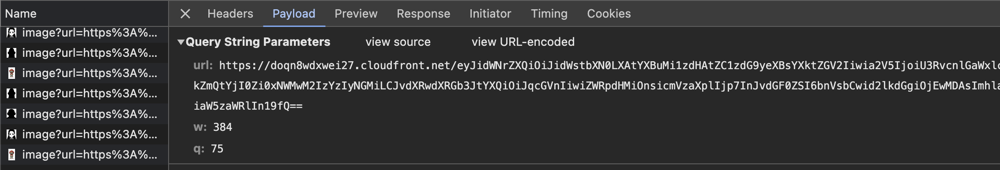
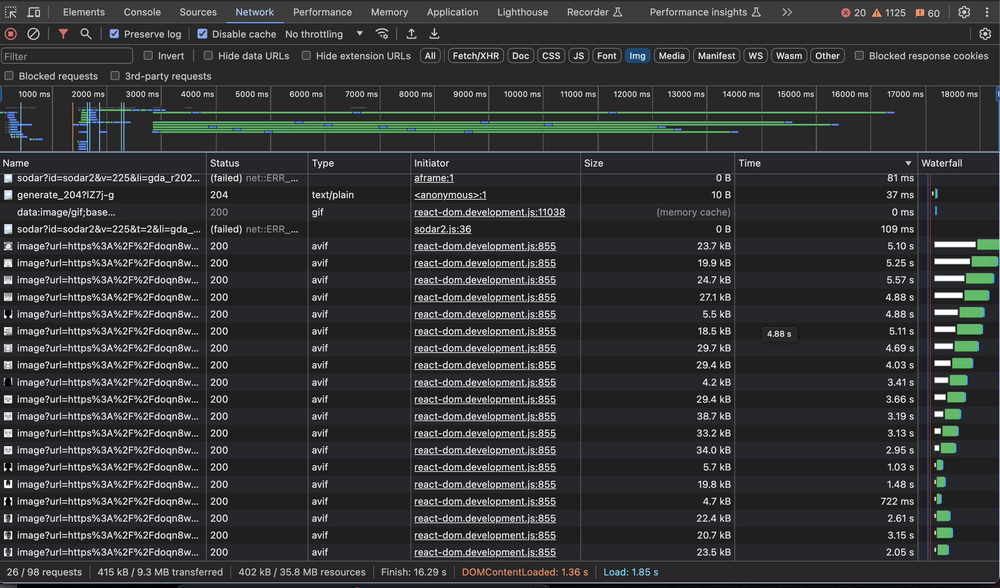

> 비주얼 노벨 형태의 소설을 서비스하는 프로젝트를 진행하게되면서 작품 내에서 사용되는 이미지의 크기와 개수가 늘어났다. 현재 스플 웹에서는 next/image를 이용해 이미지를 로딩하고있기 때문에 이번 포스팅에서는 next/image를 잘~ 활용하여 이미지의 로딩 속도를 최소화하여 사용자의 경험을 개선하는 과정을 공유하려한다.


# next/image

`next/image`는 이미지를 렌더링하기 위해 사용하는 `<image/>` 태그가 오버라이딩되어 일부 기능들이 추가된 컴포넌트이다.

## next/image 사용법

1. 로컬 이미지

정적으로 임포트된 이미지에 대해서는 빌드타임에 임포트된 이미지 파일을 기준으로 width, height, blurDataURL정보가 자동으로 생성된다.

[Cumulative Layout Shift(CLS)](https://web.dev/articles/cls?hl=ko)를 방지할 수 있는 유용한 기능이다!

```jsx
import Image from 'next/image';
import localImage from '../public/localImage.png';

const ImageComponent = () => {
	return (
			<Image
				src={localImage}
				alt="local"
			/>
	)
}
```


1. 외부 리소스에서 가져온 이미지

외부에서 가져온 이미지를 사용하기 위해서는 next.config.js 파일에서 이미지의 도메인을 지정해주어야한다.

그 이유는, 원격 이미지의 경우 Nextjs 서버에서 리모트 서버로 요청을 하는 과정에서 악의적인 사용자에 의해 공격을 받을 가능성이 있기 때문이다.

```jsx
module.exports = {
  images: {
    domains: ['your-cdn-image-domain'],
  },
};
```

리모트 이미지의 경우 정적 이미지와 같이 빌드 시점에 이미지의 width와 height를 계산할 수 없기 때문에 관련 정보를 작성해주어야한다.

```jsx
import Image from 'next/image';

const ImageComponent = () => {
	return (
			<Image
				src={'https://image/source/..../.png'}
        width={400}
        height={200}
				alt="remote"
			/>
	)
}
```


## 몇 가지 주요한 속성들

- width 속성
  - 화면에 렌더링 할 이미지의 너비 또는 불러올 이미지의 너비를 픽셀 단위로 설정한다.
  - `layout="intrinsic"`또는 `layout="fixed"`속성을 사용하는 경우, width의 너비는 이미지가 화면에 표시되는 크기를 지정한다.
  - `layout="responsive"` 또는 `layout="fill"`속성의 경우, width의 너비는 이미지의 가로세로 비율에만 영향을 준다.

- layout 속성
  - 뷰포트의 크기가 변경될 때 이미지 레이아웃이 동작하는 방식을 설정한다.
  - `layout="intrinsic"(default)
    - 컨테이너에 맞게 크기가 줄어든다.
  - `layout="fixed"
    - 지정된 width와 height에 맞게 이미지의 사이즈가 설정된다.
    - layout이 fixed인 경우 width와 height 속성은 필수 속성이다.
  - `layout="fill"
    - relative 포지션을 가진 부모 요소에 맞게 너비와 높이가 지정된다.    
  - `layout="responsive"
    - 부모 요소에 따라 이미지의 너비가 결정되며, 이미지의 비율이 유지된다.

- sizes 속성
  - 이미지의 사이즈를 화면의 뷰포트에 맞게 로딩하기 위한 속성이다.
  - next/image는 자동으로 source set을 생성하여 뷰포트에 알맞은 사이즈로 이미지를 로딩할 수 있는 기능을 제공한다.
  - 이 속성은 deviceSizes, imageSizes 속성과 결합하여 srcSet을 생성한다.

- deviceSizes
  - next.config.js에서 설정할 수 있는 속성이며 next/image 컴포넌트가 sizes 속성에 따라 사용자의 디바이스에 맞는 이미지 사이즈를 불러온다.
  - 아무런 설정도 하지 않은 경우 다음과 같이 설정된다.
    ```jsx
module.exports = {
  images: {
    deviceSizes: [640, 750, 828, 1080, 1200, 1920, 2048, 3840],
  },
}
    ```

- imageSizes
  - 이 속성도 마찬가지로 next.config.js에서 설정할 수 있는 속성이며 deviceSize와 1:1로 매칭되어 image의 srcSet 리스트를 생성하는 데 사용된다.
  - 아무런 설정도 하지 않은 경우 다음과 같이 설정된다.
    ```jsx
module.exports = {
  images: {
    imageSizes: [16, 32, 48, 64, 96, 128, 256, 384],
  },
}
    ```


**deviceSizes와 imageSizes 두 개의 리스트로 구분되어있는 이유**

imageSizes는 sizes 속성을 가지고있는 이미지에만 사용되는데, 이것은 이미지의 크기가 화면 전체의 크기보다 작다는 것을 나타낸다. 즉, imageSizes의 모든 수치는 deviceSizes의 최소값보다 작은 수치여야한다.


# 이미지를 최적화하는 방법

## **화면의 크기와 관계없이 사이즈가 고정되어있는 이미지**는 layout=”fixed”, width, height를 지정한다.

기존에는 화면의 사이즈와 관계없이 동일한 사이즈의 이미지를 렌더링하는 로직이 아래와 같이 작성되어있었다.

```jsx
// 기존 로직
import Image from 'next/image';

return (
  <div className="image-wrapper">
    <Image src={imageSrc} layout="fill"/>
  </div>
);

// css
.image-wrapper {
  position: relative;
  width: 384px;
}
```

위와 같은 방식으로 이미지를 로딩할 시, 크롬 개발자도구의 network탭에서 확인해보면 아래와 같이 3840 사이즈의 이미지를 불러오고있는 것을 볼 수 있다.

<figure>
  
</figure>


하지만 이 로직을 layout=”fixed”, width, height를 지정하는 방식으로 작성한다면,

```jsx
// 기존 로직
import Image from 'next/image';

return (
  <Image src={imageSrc} layout="fixed" width={384} height={90}/>
);

```

<figure>
  
</figure>

위와 같이 384px 사이즈의 이미지를 불러오고있는 것을 확인할 수 있다.


이 두 방식의 차이를 테스트를 위해 작품에서 사용되는 모든 이미지(총 133개)를 불러오는 페이지를 만들었다.


기존 방식대로 layout=”fill”로 적용했을 때

```jsx
 <div
      key={character.name}
      style={{
        position: 'relative',
        width: '200px',
        height: '200px',
      }}
    >
      <Image src={character.imageFile?.link || ''} layout="fill" alt="" />
    </div>
```

모든 이미지를 불러오는 데 약 23초가 소요되었다 😱

**총 리소스 크기: 788kB**

**총 소요 시간: 23.55s**

<figure>
  
</figure>

layout=”fixed”, width와 height를 적용했을 때

```jsx
  <Image
    key={character.name}
    src={character.imageFile?.link || ''}
    layout="fixed"
    width={200}
    height={200}
    alt=""
  />
```

모든 이미지를 불러오는 데 약 16초가 소요되었다.

<figure>
  
</figure>

**총 리소스 크기: 402kB**

**총 소요 시간: 16.29s**


## webp보다 압축률이 좋은 avif를 사용한다.

## 별로 중요하지 않은 이미지, 또는 작게 보여지는 이미지들의 quality를 조금씩 낮춘다.


